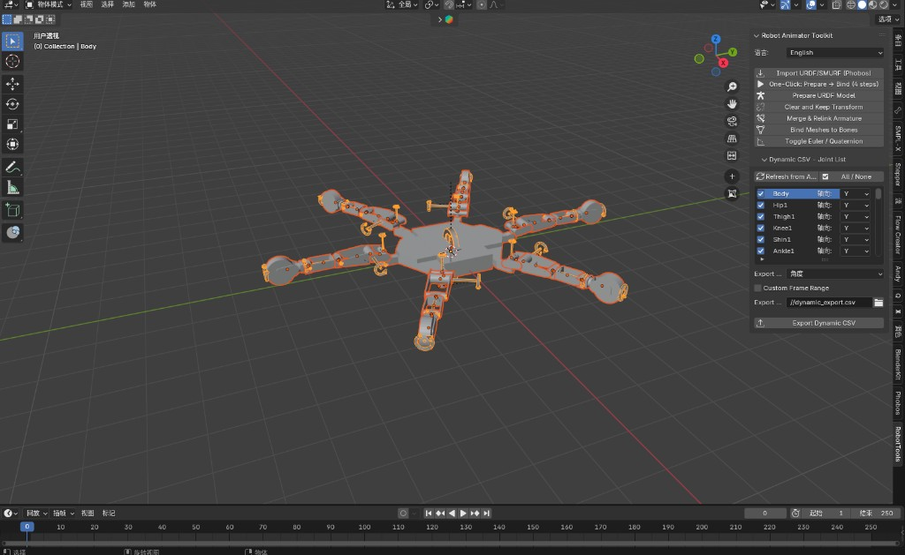

# Robot Animator Toolkit

[中文](README.md) | [English](README.en.md)

A Blender add-on for URDF robots: **armature merge/relink, mesh rebinding, and dynamic CSV export**, with an end-to-end workflow from URDF/SMURF import to animation data export.

Supports Blender 3.3+ (4.2 recommended).

## Quick Start (3 Steps)

1. **Import model**: Click **Import URDF/SMURF (Phobos)** and choose your robot file (`.urdf` / `.smurf` / `.xacro`, etc.).
2. **One-click process**: Select at least one Armature, then click **One-Click: Prepare → Bind (4 steps)**.
3. **Export data**: In **Dynamic CSV - Joint List**, refresh joints and configure options, then click **Export Dynamic CSV**.

## UI Screenshot



---

## Feature Overview

| Feature | Description |
|------|------|
| **Supported Blender versions** | **3.3+ (4.2 recommended)** |
| **Import URDF/SMURF (Phobos)** | Import robot models from `.urdf` / `.smurf` / `.xacro` / `.xml` using the built-in Phobos module, with automatic `package://` and relative mesh path resolution. |
| **One-Click: Prepare → Bind (4 steps)** | Runs: Prepare URDF Model → Clear and Keep Transform → Merge & Relink Armature → Bind Meshes to Bones. |
| **Prepare URDF Model** | Detects selected Armatures, sets `base_link` as active, and selects all objects for the next step. |
| **Clear and Keep Transform** | Records current URDF hierarchy, then clears parent relations while preserving world transforms. |
| **Merge & Relink Armature** | Merges selected Armatures into one and rebuilds hierarchy (prefers recorded URDF hierarchy). |
| **Toggle Euler / Quaternion** | One-click switch for all bones' rotation mode (Euler XYZ ↔ Quaternion). |
| **Bind Meshes to Bones** | Auto-binds meshes to matched bones by name while preserving world-space transforms. |
| **Export Dynamic CSV** | Exports per-frame joint rotation values to CSV with angle unit selection (degrees/radians). |

**Joint list subpanel (Dynamic CSV - Joint List)**: refresh joints from armature, all/none toggle, per-joint axis (X/Y/Z), custom frame range, export unit, and export path.

---

## Installation

1. Zip the whole **Robot Animator Toolkit** folder (must include `__init__.py` and `phobos/`).
2. In Blender: **Edit → Preferences → Add-ons → Install**, then choose the zip (or install from folder).
3. Enable **Robot Animator Toolkit**.
4. Open 3D View, press **N**, and switch to **RobotTools** tab.

Dependency notes: URDF import relies on built-in Phobos. For Blender 4.2, STL import may use optional `trimesh` fallback if STL operator is unavailable.

---

## Recommended Workflow

1. **Import**  
   Click **Import URDF/SMURF (Phobos)**, then select your robot file.

2. **Fast flow (recommended)**  
   Select at least one Armature and click **One-Click: Prepare → Bind (4 steps)**.

3. **Manual flow (optional)**  
   Use buttons step by step: Prepare → Clear → Merge → Bind.

4. **Rotation mode switch (optional)**  
   Click **Toggle Euler / Quaternion** on the merged armature as needed.

5. **Export Dynamic CSV**  
   Open **Dynamic CSV - Joint List**, refresh joint list, configure joints/axes/range/unit, then export.

---

## Hierarchy Notes

- **Preferred**: If hierarchy is recorded during “Clear and Keep Transform”, merge/relink restores parent-child relationships from that record.
- **Fallback**: If no valid record exists, built-in `CHAIN_RULES` naming inference is used.

---

## File Structure

```text
Robot Animator Toolkit/
  __init__.py    # Main add-on logic (operators, panel, properties)
  phobos/        # Embedded Phobos submodule (URDF/SMURF parsing and import)
  README.md      # Chinese readme
  README.en.md   # English readme
```

---

## Notes

- For CSV export, Euler mode is usually recommended.
- With custom frame range enabled, start frame must be <= end frame.

---

## Acknowledgements

This add-on reuses **Phobos** capabilities for URDF/SMURF import (via the embedded `phobos/` submodule).  
Thanks to the Phobos open-source project and contributors.
